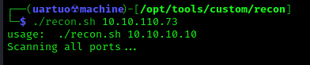
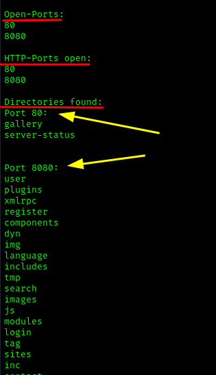
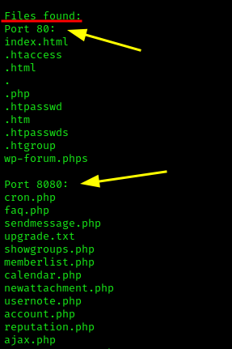

# Ferramenta de recon básico para ctfs
- Modo de uso
  
```bash
./recon.sh 10.10.10.10 
```

Essa ferramenta automatiza parte da fase inicial de recon em http que costuma ser um pouco repetitiva em CTFs.



# Funcionalidades
- Lista as portas abertas usando o Rustscan e o Nmap.
- Faz fuzzing de diretórios e arquivos usando o FFuF em todas as portas identificadas com o serviço http.
- Cria um arquivo final de output com todas as informações obtidas.




# Observações
- O fuzzing não é recursivo.
Ele funciona com base em duas listas com o caminho especificado em .

- Essa automatização utiliza arquivos de texo temporários para processar o arquivo final de output, no final eles são excluídos.
- Se você é impaciente, você pode ver o resultado parcial dos arquivos gerados temporariamente na pasta do programa.
- Não se esqueça de alterar a permissão para poder executá-lo da forma mencionada acima.

```bash
chmod +x recon.sh
```
